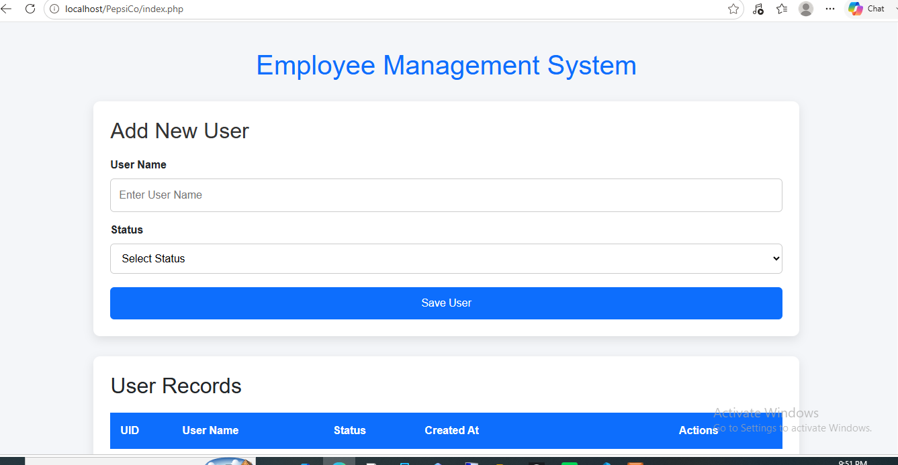
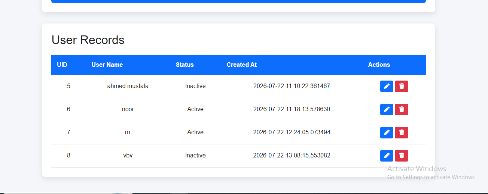
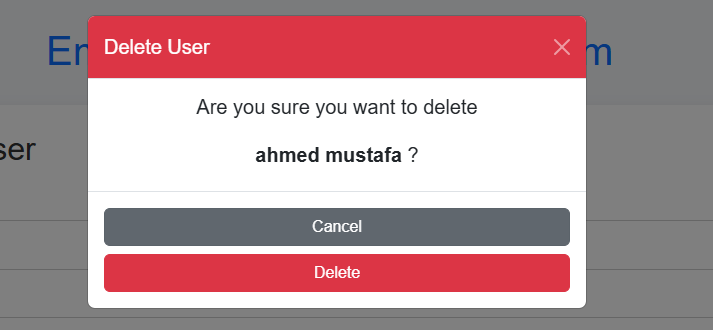
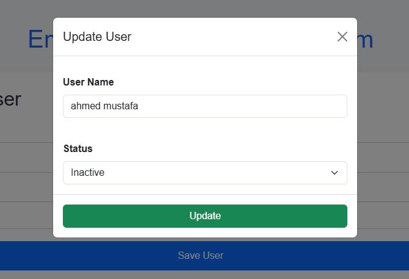

# 🚀 Employee Management System

> A modern **Employee Management System** built with **PHP, MySQL, Bootstrap 5, JavaScript, AJAX, and JSON** that demonstrates complete CRUD (Create, Read, Update, Delete) functionality with a clean, responsive user interface.


---

# 📖 Overview

The **Employee Management System** is a full-stack web application developed using **PHP** and **MySQL**. The application allows users to efficiently manage employee records through a modern web interface.

Unlike traditional PHP CRUD projects, employee data is loaded dynamically using the **Fetch API** and **JSON**, creating a smoother and more interactive user experience.

This project demonstrates practical implementation of modern web development concepts including:

- CRUD Operations
- Database Connectivity
- AJAX Requests
- JSON Data Handling
- Responsive UI Design
- Bootstrap Components
- JavaScript DOM Manipulation

---

# ✨ Features

- ✅ Add New Employees
- ✅ View Employee Records
- ✅ Update Employee Details
- ✅ Delete Employees
- ✅ Bootstrap Responsive Interface
- ✅ Dynamic Data Loading using Fetch API
- ✅ JSON API Integration
- ✅ MySQL Database Connectivity
- ✅ Edit & Delete Confirmation Modals
- ✅ Clean and Professional UI

---

# 🛠 Technologies Used

| Technology | Purpose |
|------------|----------|
| PHP | Backend Development |
| MySQL | Database |
| Bootstrap 5 | Responsive UI |
| JavaScript | Dynamic Functionality |
| Fetch API | AJAX Requests |
| JSON | Data Exchange |
| HTML5 | Structure |
| CSS3 | Styling |
| Font Awesome | Icons |

---

# 📂 Project Structure

```
Employee-Management-System
│
├── index.php
├── db_con.php
├── formSubmit.php
├── getData.php
├── edit.php
├── update.php
├── delete.php
├── style.css
├── database.sql
└── README.md
```

---

# ⚙️ How It Works

### Step 1

User fills out the employee form.

⬇

### Step 2

PHP receives the form data.

⬇

### Step 3

Data is stored in the MySQL database.

⬇

### Step 4

JavaScript sends a request to:

```
getData.php
```

⬇

### Step 5

PHP converts database records into JSON.

⬇

### Step 6

JavaScript receives the JSON response.

⬇

### Step 7

Employee records are displayed dynamically inside the table.

⬇

### Step 8

Bootstrap modals allow users to edit or delete records.

---

# 📸 Screenshots


```
├── dashboard.png
├── add-user.png
├── edit-user.png
└── delete-user.png
```

Example:

```markdown







```

---

# 🚀 Installation

## Clone Repository

```bash
git clone https://github.com/yashfamustafa/Employee-Management-System.git
```

## Go to Project Folder

```bash
cd Employee-Management-System
```

## Move Project

Copy the project into your XAMPP **htdocs** folder.

Example:

```
C:\xampp\htdocs\
```

## Create Database

Create a MySQL database named:

```
employee
```

Import the provided SQL file.

## Start Server

Start:

- Apache
- MySQL

using **XAMPP Control Panel**.

## Run Project

```
http://localhost/Employee-Management-System
```

---

# 📊 Application Architecture

```
             User
               │
               ▼
        HTML Form
               │
               ▼
             PHP
               │
               ▼
            MySQL
               │
               ▼
        getData.php
               │
               ▼
             JSON
               │
               ▼
         JavaScript
               │
               ▼
      Dynamic HTML Table
```

---

# 🎯 Learning Outcomes

This project demonstrates understanding of:

- PHP Programming
- MySQL Database
- CRUD Operations
- Fetch API
- AJAX
- JSON
- Bootstrap 5
- Responsive Design
- JavaScript
- Database Connectivity

---

# 🔮 Future Improvements

- User Authentication
- Admin Dashboard
- Search Functionality
- Pagination
- Sorting & Filtering
- Export to Excel
- Export to PDF
- Employee Images
- REST API
- MVC Architecture
- Prepared Statements
- Input Validation
- Dashboard Analytics

---

# 🤝 Contributing

Contributions are welcome!

If you'd like to improve this project:

1. Fork the repository.
2. Create a new feature branch.
3. Commit your changes.
4. Push to your branch.
5. Open a Pull Request.

---

# 👩‍💻 Author

**Yashfa Mustafa**

Software Engineering Student

**Skills**

- PHP Development
- MySQL
- JavaScript
- Bootstrap
- HTML5 & CSS3
- Database Design
- Web Development

---

# ⭐ Show Your Support

If you found this project helpful, please consider giving it a ⭐ on GitHub.

It motivates me to continue building and sharing more projects.

---

# 📜 License

This project is licensed under the **MIT License**.

---

## 💬 Repository Description

> A modern Employee Management System built with PHP, MySQL, Bootstrap 5, JavaScript, AJAX, and JSON featuring complete CRUD operations, responsive UI, and dynamic data loading.

