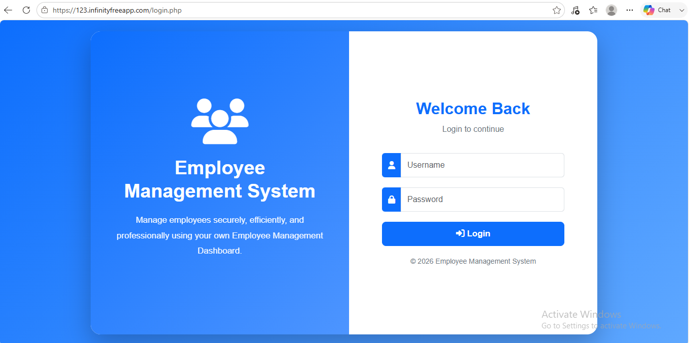
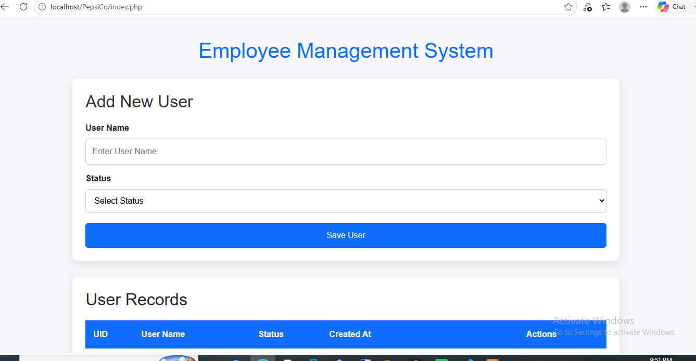
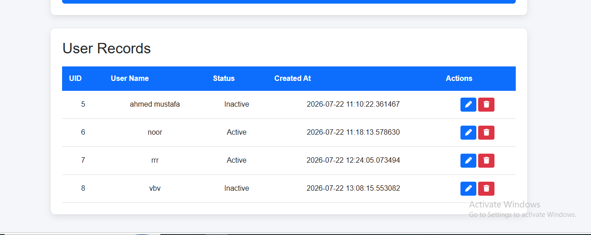
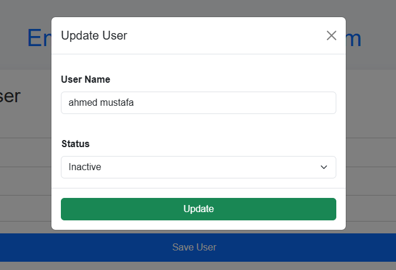
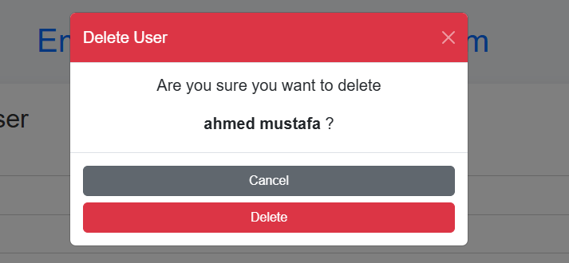

# 🚀 Employee Management System

<p align="center">


</p>

---

# 📖 Overview

The **Employee Management System** is a modern full-stack web application developed using **PHP**, **MySQL**, **Bootstrap 5**, **JavaScript**, **AJAX (Fetch API)**, and **JSON**.

The application allows administrators to securely manage employee records through complete **CRUD (Create, Read, Update, Delete)** functionality while providing a clean, responsive, and user-friendly interface.

To improve security, the system includes a **Login Authentication** module with **Session Management**, ensuring that only authenticated users can access the employee dashboard. Employee records are loaded dynamically using the **Fetch API**, resulting in a smoother user experience without requiring full page reloads.

This project demonstrates practical implementation of backend development, database management, authentication, asynchronous communication, responsive web design, and full-stack application development.

---

# ✨ Project Highlights

- 🔐 Secure Login Authentication
- 👤 Session-Based User Access
- ➕ Add New Employees
- 📋 View Employee Records
- ✏️ Update Employee Information
- ❌ Delete Employee Records
- 📊 Dashboard Statistics
- 🔍 Live Employee Search
- ⚡ Fetch API (AJAX)
- 📄 JSON Data Exchange
- 📱 Responsive Bootstrap Interface
- 💾 MySQL Database Integration

---

# 🚀 Key Features

- User Login Authentication
- Session Management
- Employee Registration
- Employee Listing
- Live Employee Search
- Update Employee Details
- Delete Employee Records
- Dashboard Statistics
  - Total Employees
  - Active Employees
  - Inactive Employees
- Dynamic Employee Loading using Fetch API
- JSON-Based Communication
- Bootstrap Responsive Design
- Edit Employee Modal
- Delete Confirmation Modal
- Clean and Organized Code Structure

---

# 🛠 Technology Stack

| Category | Technologies |
|-----------|--------------|
| Backend | PHP |
| Database | MySQL |
| Frontend | HTML5, CSS3, Bootstrap 5 |
| Client-side | JavaScript (ES6) |
| AJAX | Fetch API |
| Data Format | JSON |
| Authentication | PHP Sessions |
| Version Control | Git & GitHub |

---

# 🏗 Application Architecture

```text
Browser
    │
    ▼
HTML • CSS • Bootstrap • JavaScript
    │
    ▼
Fetch API (AJAX)
    │
    ▼
PHP Backend
    │
    ▼
MySQL Database
```

Employee data is requested from the server using the Fetch API, processed by PHP, retrieved from the MySQL database, converted into JSON format, and rendered dynamically on the webpage.

---

# 🔐 Authentication Flow

```text
User
   │
   ▼
Login Page
   │
   ▼
loginProcess.php
   │
   ▼
Validate Credentials
   │
   ▼
Create PHP Session
   │
   ▼
Dashboard
   │
   ▼
Logout
```

Only authenticated users can access the Employee Dashboard. Unauthorized users are automatically redirected to the Login page.

---

# 📁 Project Structure

```text
Employee-Management-System
│
├── login.php
├── loginProcess.php
├── logout.php
│
├── index.php
├── db_con.php
├── formSubmit.php
├── getData.php
├── edit.php
├── update.php
├── delete.php
│
├── style.css
├── dashboard.css
│
├── database.sql
│
├── login.png
├── dashboard.png
├── add-user.png
├── edit-user.png
├── delete-user.png
│
└── README.md
```

---

# ⚙ Core Functionality

The application provides the following modules:

- User Authentication
- Session Management
- Employee Registration
- Employee Listing
- Dashboard Statistics
- Live Employee Search
- Employee Editing
- Employee Deletion
- Dynamic Data Rendering
- Database Connectivity
- Responsive User Interface

---

# 💻 Skills Demonstrated

This project demonstrates practical experience with:

- PHP Development
- Authentication & Session Management
- CRUD Operations
- MySQL Database Design
- SQL Queries
- Fetch API
- AJAX Communication
- JSON Data Handling
- DOM Manipulation
- Bootstrap Components
- Responsive Web Design
- Client–Server Communication
- Dashboard Development
- Full-Stack Web Development

---

# ⚙ Installation

## 1. Clone the Repository

```bash
git clone https://github.com/yashfamustafa/Employee-Management-System.git
```

---

## 2. Navigate to the Project

```bash
cd Employee-Management-System
```

---

## 3. Copy Project

Move the project folder into your XAMPP **htdocs** directory.

Example:

```text
C:\xampp\htdocs\
```

---

## 4. Create Database

Create a database named:

```sql
CREATE DATABASE employee;
```

Import the provided **database.sql** file.

---

## 5. Start XAMPP

Start the following services:

- Apache
- MySQL

---

## 6. Run the Application

Open your browser and visit:

```text
http://localhost/Employee-Management-System/login.php
```

---

# 🔑 Demo Login

Use the credentials stored in your database.

Example:

| Username | Password |
|----------|----------|
| admin | admin123 |

> Replace these credentials with your own database records if different.

---

# 📸 Screenshots


## Login Page



---

## Dashboard



---

## Add Employee



---

## Edit Employee



---

## Delete Employee



---

# 🚀 Future Enhancements

Planned improvements include:

- User Registration
- Role-Based Access Control (Admin/User)
- Password Hashing
- Forgot Password Feature
- Pagination
- Advanced Search & Filters
- Export to Excel
- Export to PDF
- Employee Profile Images
- REST API Integration
- MVC Architecture
- Prepared Statements
- Advanced Validation
- Email Notifications

---

# 👩‍💻 About the Developer

## **Yashfa Mustafa**

Software Engineering student passionate about **Full-Stack Web Development**, **Database Systems**, **Software Engineering**, and modern web technologies. I enjoy building responsive, database-driven applications while continuously improving my programming and problem-solving skills.

---

# 📬 Connect With Me

### GitHub

https://github.com/yashfamustafa

### LinkedIn

https://www.linkedin.com/in/yashfa-mustafa-2963463a3

### Email

yashfamustafa04@gmail.com

---

# 🤝 Contributing

Contributions, suggestions, and improvements are welcome.

Feel free to fork this repository and submit a Pull Request.

---

# 📄 License

This project is licensed under the **MIT License**.

---

# ⭐ Support

If you found this project helpful or learned something from it, please consider giving it a **⭐ Star** on GitHub. Your support helps motivate future development and encourages others to explore the project.
